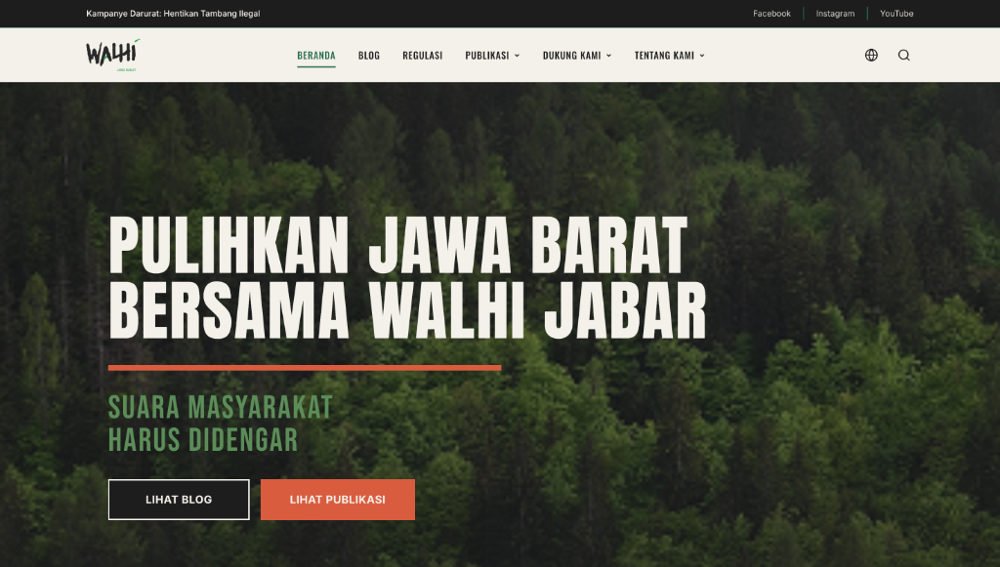

<div align="center">

# 🌿 WALHI Jawa Barat — Official Web Platform

[](https://laravel.com)
[](https://tailwindcss.com)
[](https://alpinejs.dev)
[](https://www.docker.com)
[](LICENSE)

<br />



<br />

**Portal Informasi, Advokasi Lingkungan, Publikasi Kebijakan, dan Gerakan Rakyat WALHI Jawa Barat**

[Fitur Utama](#-fitur-utama) • [Panduan Cepat](#-panduan-menjalankan-aplikasi) • [Struktur Sistem](#-arsitektur--struktur-direktori) • [Kolaborasi & Tim](#-panduan-kolaborasi-tim) • [Keamanan](#-keamanan--audit)

</div>

---

## 📖 Tentang Proyek

Website resmi **Wahana Lingkungan Hidup Indonesia (WALHI) Jawa Barat** dirancang untuk mendokumentasikan, mengadvokasi, dan menggalang solidaritas publik demi kelestarian ekosistem dan keadilan ruang hidup rakyat di Jawa Barat.

Mengusung gaya desain **Neo-Brutalisme Hijau Ekologis**, platform ini memberikan pengalaman pengguna yang lugas, responsif, berbobot, serta mudah diakses oleh publik, pegiat lingkungan, jurnalis, maupun donatur.

---

## ✨ Fitur Utama

- 📰 **Portal Publikasi & Advokasi:**
  - Artikel Berita & Blog Lingkungan
  - Siaran Pers Resmi & Rilis Sikap Organisasi
  - Infografis Edukasi Ekologi
  - Laporan Tahunan & Dokumen Regulasi Lingkungan
- 💚 **Gerakan Dukungan & Donasi:**
  - Modul Donasi Terintegrasi dengan Nominal Cepat
  - Simulasi & Integrasi Payment Gateway
- 👥 **Profil Organisasi & Jaringan:**
  - Direktori 29 Lembaga Anggota di 13 Kabupaten/Kota Jawa Barat
  - Visi, Misi, 10 Nilai Perjuangan, dan 6 Program Strategis
  - Garis Sejarah Gerakan sejak 1980 & Struktur Kepengurusan
- 🎪 **Pekan Rakyat Lingkungan Hidup:**
  - Manajemen kampanye dan festival rakyat
- 🔐 **Backoffice CMS & Panel Admin:**
  - Manajemen Konten (Tambah, Edit, Publish/Archive)
  - Log Audit Keamanan (*Audit Trail*)
  - Manajemen Donasi Masuk & Pengaturan Kontak Global

---

## 🚀 Panduan Menjalankan Aplikasi

Anda dapat menjalankan project ini dengan dua metode:

### 🐳 Metode 1: Menggunakan Docker (Direkomendasikan)

Metode ini paling praktis karena seluruh dependensi (PHP 8.4, Composer, Node.js build, SQLite database, dan permissions) dikonfigurasi secara otomatis di dalam container.

1. **Clone repository dan masuk ke direktori:**
   ```bash
   git clone https://github.com/Irs622/walhi_larafel.git
   cd walhi_larafel
   ```

2. **Jalankan container:**
   ```bash
   docker compose up -d --build
   ```

3. **Buka aplikasi di browser:**
   - 🌐 **Website Publik:** [http://localhost:8000](http://localhost:8000)
   - 🔑 **Panel Admin:** [http://localhost:8000/admin](http://localhost:8000/admin)

4. **Perintah Docker yang Berguna:**
   ```bash
   # Melihat log container secara real-time
   docker compose logs -f

   # Menghentikan container
   docker compose down

   # Menjalankan perintah artisan di dalam container
   docker compose exec app php artisan migrate:status
   ```

---

### 💻 Metode 2: Menjalankan Secara Manual (Lokal)

Jika Anda ingin menjalankan langsung di lingkungan host (memerlukan PHP 8.2+, Composer, dan Node.js 18+):

1. **Install dependensi PHP & Node.js:**
   ```bash
   composer install
   npm install
   ```

2. **Setup environment:**
   ```bash
   cp .env.example .env
   php artisan key:generate
   ```

3. **Jalankan migrasi database & seeder:**
   ```bash
   touch database/database.sqlite
   php artisan migrate --seed
   ```

4. **Jalankan server pengembangan:**
   ```bash
   npm run build
   php artisan serve
   ```

---

## 🔑 Kredensial Default (Testing Lokal)

| Role | Email | Password |
| :--- | :--- | :--- |
| **Super Admin** | `admin@walhi-jabar.org` | `admin123` |
| **Staff / Editor** | `editor@walhi-jabar.org` | `editor123` |

*(Kredensial dapat diubah melalui file `.env` atau variabel `ADMIN_PASSWORD` pada Docker).*

---

## 🏗️ Arsitektur & Struktur Direktori

Untuk penjelasan mendalam mengenai pola arsitektur, diagram aliran data, dan skema database, silakan pelajari dokumen:
👉 **[Dokumen Arsitektur Lengkap (ARCHITECTURE.md)](ARCHITECTURE.md)**

```
walhi_larafel/
├── app/               # Controllers, Models, Services, Policies
├── database/          # Migrations & Seeders
├── resources/
│   ├── css/           # Tailwind CSS styling
│   ├── js/            # Alpine.js script logic
│   └── views/         # Blade templates & components
├── public/            # Static assets (images, icons, build)
├── docker-entrypoint.sh # Skrip boot otomatis container
└── docker-compose.yml # Konfigurasi Docker multi-container
```

---

## 🤝 Panduan Kolaborasi Tim

Kami menyambut kontribusi dari seluruh anggota tim dan komunitas! Sebelum mulai berkontribusi, harap membaca panduan berikut:

- 📋 **[Panduan Kontribusi (CONTRIBUTING.md)](CONTRIBUTING.md)**: Alur kerja git branch, konvensi commit pesan, dan langkah Pull Request.
- 📜 **[Kode Etik (CODE_OF_CONDUCT.md)](CODE_OF_CONDUCT.md)**: Standar komunikasi dan etika kerja komunitas.
- 🔒 **[Kebijakan Keamanan (SECURITY.md)](SECURITY.md)**: Prosedur pelaporan celah keamanan.

---

## 📄 Lisensi

Proyek ini dilisensikan di bawah [MIT License](LICENSE).
Hak Cipta © 2026 **WALHI Jawa Barat**.
